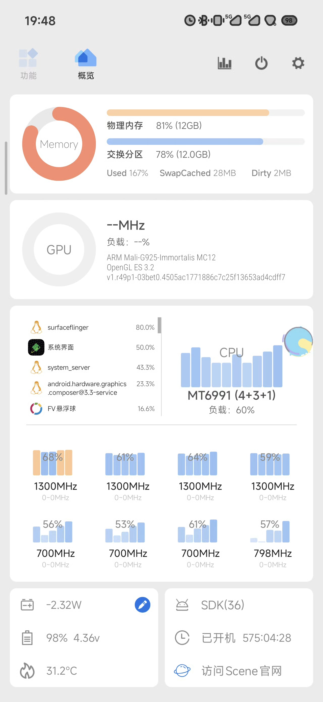
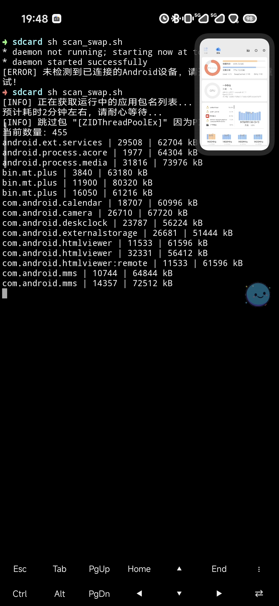
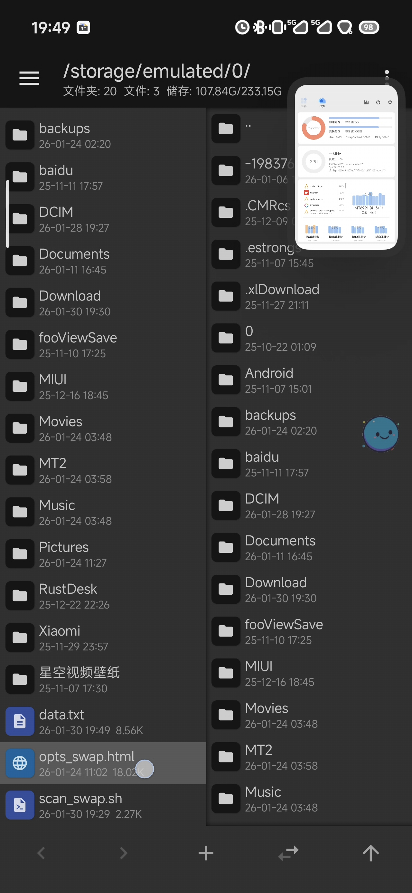
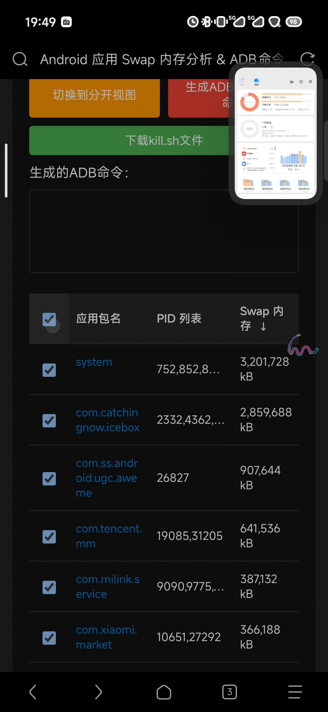
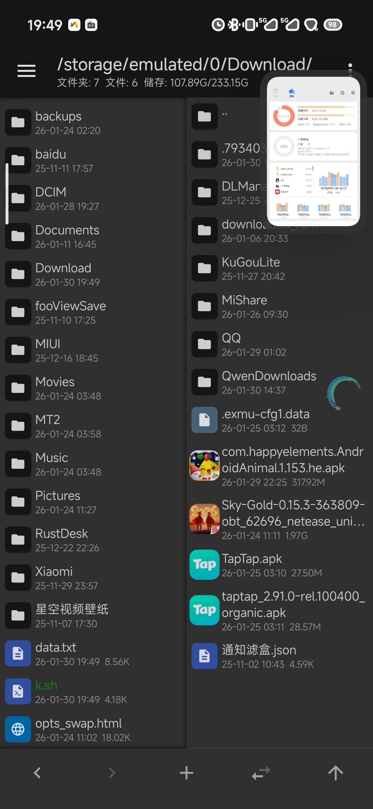
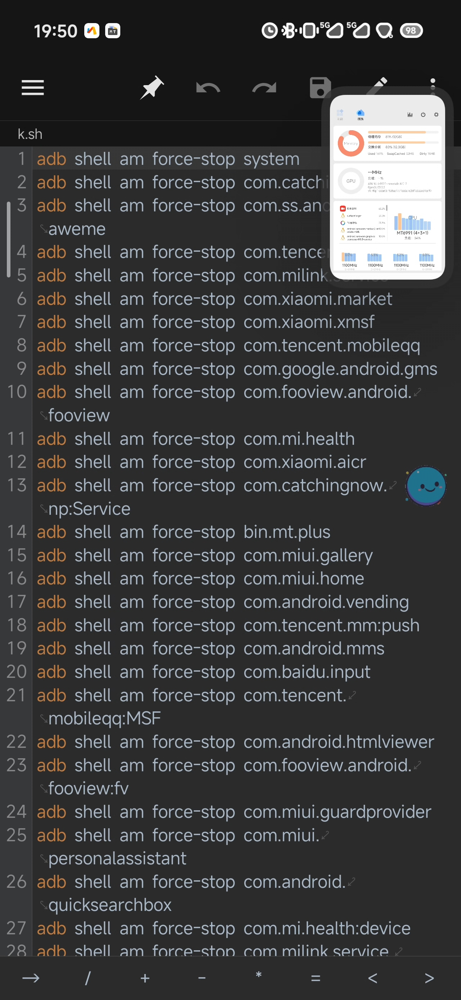
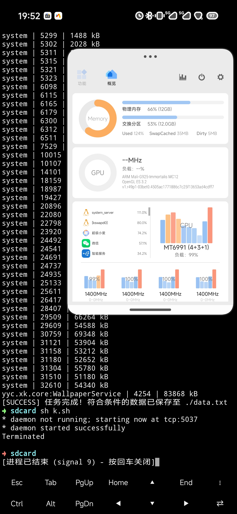
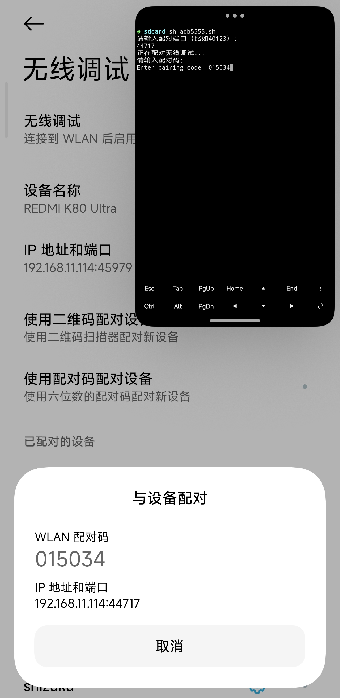
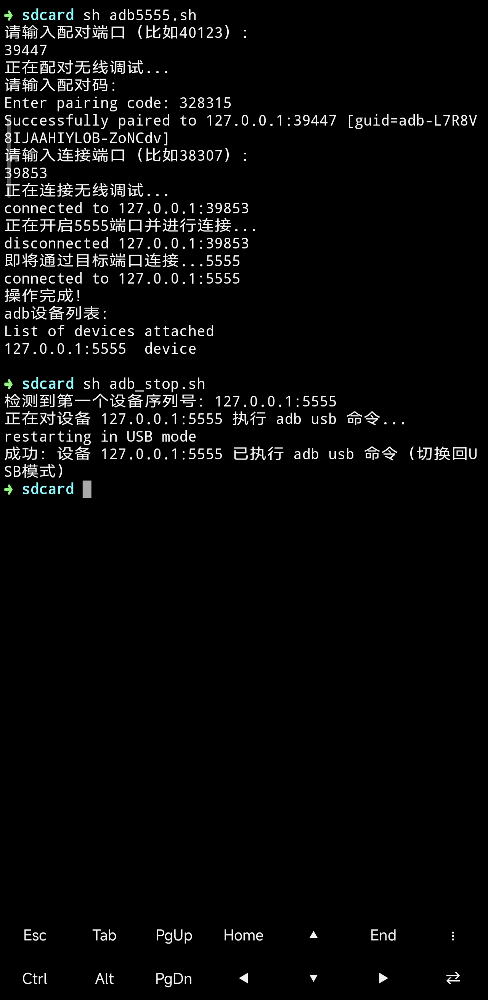

<!-- 

如果你看到了这段文字，请先手动访问以下链接进入首页，用于加载 sw.js 服务。
https://lolo.hk/docs/index.html

或者尝试访问编译后的版本，只需要在当前链接的问号 ? 前面（如果没有问号 ? 那么在链接的最后）添加 .html 进行尝试访问

-->

# 感谢共同研究
[@萧白666](https://www.coolapk.com/u/27419344)

# 优化手机因为内存占用导致的卡顿问题
理论是所有设备通用的

## 核心原理
将占用内存大的 `APP强行停止` ，这样可以 `清理他的内存溢出` 。 系统app也可以强行停止，他会自己重启

## 相关资源

**脚本:**
  1. [kill.sh](res/a1-kill.sh)
  2. [scan_swap.sh](res/a1-scan_swap.sh)  

**网页:**
  1. [opts_swap.html](res/a1-opts_swap.html)

# 快速操作
> 需求: `拥有adb权限`  

1. 使用 [kill.sh](res/a1-kill.sh) 脚本
2. 在 `任意可运行adb权限的"终端"` 中使用命令运行脚本 `sh kill.sh` 

# 完整版本 - 自行创建 kill.sh 
> 需求: `拥有原生adb权限`  
> 所有的 `运行命令` 均指在MT管理器的左侧边抽屉栏的终端模拟器中使用命令  
> 所有的脚本均是在 `当前用户根目录 ("/storage/emulated/0/" 或 "sdcard")` 下，命令也是在这个目录下运行  
## 前置操作 

1. 下载所有脚本并将其放到根目录
2. [获取原生adb权限 -  打开adb端口](#打开adb端口)

## 具体步骤

### 一、构建app列表
* [初始内存占用情况图](res/a1-1.jpg)   

1. 运行命令 `sh scan_swap.sh` 使用 `scan_swap.sh` 脚本生成 `data.txt` 数据文件 `(如果提示 未检测到已连接的Android... 那么再运行一次即可)`
* [运行scan_swap.sh时的图](res/a1-2.jpg)   

### 二、构建kill.sh脚本
1. 长按 `opts_swap.html` 使用浏览器打开该网页文件 (可以 [直接点击](/docs/mds/图文帖/res/a1-opts_swap.html) 访问这个页面) 
* 需要自行找到使用浏览器打开网页文件, [长按opts_swap.html文件的图](res/a1-3.jpg)   

1. 网页中点击大片绿色背景的 `选择文件` 按钮，选择上面生成的 `data.txt` 文件 
2. 点击下方列表的表头 `应用包名` 前面的 `勾选框` 进行`全选` 
* [点击勾选全部的图](res/a1-4.jpg)   

1. 根据需求取消勾选不需要停止的app，也可以在 kill.sh 文件中手动删除 
2. 点击红色按钮 `生成ADB强制停止命令` 
3. 点击绿色按钮 `下载kill.sh文件` 下载sh脚本
4. 将下载的kill.sh脚本自行改名(例如改成k.sh)，然后复制到用户根目录下
* [将改名后的k.sh文件复制到脚本所在目录的图](res/a1-5.jpg)   

* 可以根据自身需求删减或增加k.sh文件内的指令, [k.sh的内容图](res/a1-6.jpg)   

### 三、执行脚本批量强制停止app
9. 运行命令 `sh kill.sh` (如果kill.sh的脚本名称是 k.sh 那么运行 `sh k.sh`) 使用kill.sh脚本批量强行停止app
* [运行结果图](res/a1-7.jpg)   

# 优化方向
> 理论上找到真正影响手机卡顿的几个app，手动进入应用详情里强制停止也可以

## 通用的kill.sh优化方向
1. `kill.sh` 脚本中找出真正影响手机卡顿的系统app
2. `kill.sh` 脚本中保留用户的app。一般用户的app不会导致这种问题

## 不同品牌、不同系统的kill.sh优化方向
1. 根据不同品牌、不同系统，列出不同的影响手机卡顿的系统app

## 用户的kill.sh优化方向
1. 可以根据自己的需求，将系统运行脚本时会强制停止的app加入kill.sh列表

# adb端口操作

## 打开adb端口
>  用于开启adb端口，用于运行 adb 相关命令

1. 使用命令 `sh adb5555.sh` 运行 `adb5555.sh` 脚本开启端口并连接
* [开启adb端口并连接](res/a1-8.jpg)   

2. 先输入弹窗 `下方的端口`
3. 再输入弹窗的 `配对码`
4. 最后输入 `上方的端口`
* [正常连接成功](res/a1-9.jpg)   

## 关闭adb端口
> 安全操作，关不关都行，关上更安全，但是关上后需要重新配对 shizuku 

1. 使用命令 `sh adb_stop.sh` 运行 `adb_stop.sh` 脚本进行关闭端口
* [正常关闭成功](res/a1-9.jpg)   
