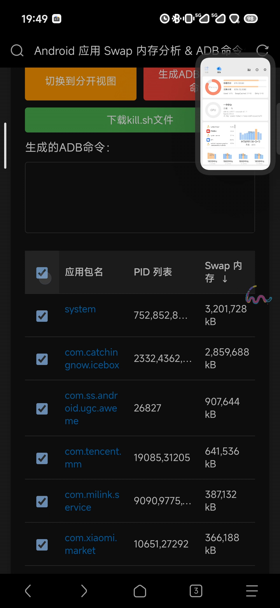
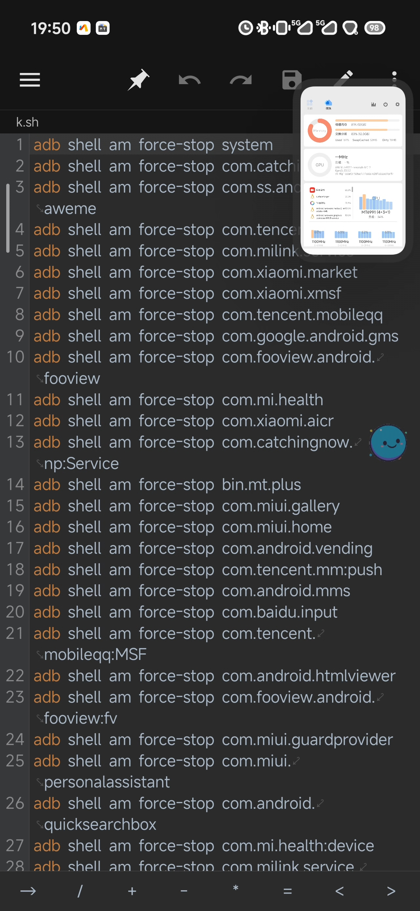

> # <a id="文档顶部" href="#文档目录">优化手机因为内存占用导致的卡顿问题↘</a>

## 核心原理
将占用内存大的 `APP强行停止` ，这样可以 `清理他的内存溢出` 。 系统app也可以强行停止，他会自己重启

## 快速操作
> 需求: `拥有adb权限`  

1. 下载对应的通用脚本 `kill.sh`
2. 在 `MT管理器` 的左侧边抽屉栏的 `终端模拟器` 中使用命令运行脚本 `sh kill.sh` 

## 完整版本
> 需求: `拥有adb权限`  
> 所有的 `运行命令` 均指在MT管理器的左侧边抽屉栏的终端模拟器中使用命令  
> 所有的脚本均是在 `当前用户根目录 (/storage/emulated/0/ 或 sdcard)` 下，命令也是在这个目录下运行  

### 一、构建app列表
* [初始内存占用情况图](res/a1-1.jpg) 
1. 运行命令 `sh scan_swap.sh` 使用 `scan_swap.sh` 脚本生成 `data.txt` 数据文件 `(如果提示 未检测到已连接的Android... 那么再运行一次即可)`
* [运行scan_swap.sh时的图](res/a1-2.jpg) 

### 二、构建kill.sh脚本
1. 长按 `opts_swap.html` 使用浏览器打开该网页文件 (可以[直接点击访](/docs/mds/图文贴/res/a1-opts_swap.html)问这个页面) 
* 需要自行找到使用浏览器打开网页文件, [长按opts_swap.html文件的图](res/a1-3.jpg) 
1. 网页中点击大片绿色背景的 `选择文件` 按钮，选择上面生成的 `data.txt` 文件 
2. 点击下方列表的表头 `应用包名` 前面的 `勾选框` 进行`全选` 
* [点击勾选全部的图](res/a1-4.jpg) 
1. 根据需求取消勾选不需要停止的app，也可以在 kill.sh 文件中手动删除 
2. 点击红色按钮 `生成ADB强制停止命令` 
3. 点击绿色按钮 `下载kill.sh文件` 下载sh脚本
4. 将下载的kill.sh脚本自行改名(例如改成k.sh)，然后复制到用户根目录下
* [将改名后的k.sh文件复制到脚本所在目录的图](res/a1-5.jpg) 
* 可以根据自身需求删减或增加k.sh文件内的指令, [k.sh的内容图](res/a1-6.jpg) 

### 三、执行脚本批量强制停止app
9. 运行命令 `sh kill.sh` (如果kill.sh的脚本名称是 k.sh 那么运行 `sh k.sh`) 使用kill.sh脚本批量强行停止app
* 运行结果图

## 优化方向
> 理论上找到真正影响手机卡顿的几个app，手动进入应用详情里强制停止也可以

### 通用的kill.sh优化方向
1. kill.sh 脚本中找出真正影响手机卡顿的系统app
2. kill.sh 脚本中保留用户的app。一般用户的app不会导致这种问题

### 不同品牌、不同系统的kill.sh优化方向
1. 根据不同品牌、不同系统，列出不同的影响手机卡顿的系统app

### 用户的kill.sh优化方向
1. 可以根据自己的需求，将系统运行脚本时会强制停止的app加入kill.sh列表

> # <a id="文档目录" href="#文档顶部">文档顶部↗</a>
- [核心原理](#核心原理)
- [快速操作](#快速操作)
- [完整版本](#完整版本)
  - [一、构建app列表](#一构建app列表)
  - [二、构建kill.sh脚本](#二构建killsh脚本)
  - [三、执行脚本批量强制停止app](#三执行脚本批量强制停止app)
- [优化方向](#优化方向)
  - [通用的kill.sh优化方向](#通用的killsh优化方向)
  - [不同品牌、不同系统的kill.sh优化方向](#不同品牌不同系统的killsh优化方向)
  - [用户的kill.sh优化方向](#用户的killsh优化方向)

---