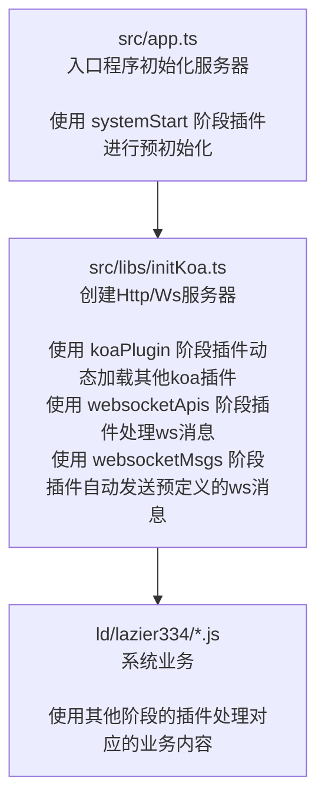

# 项目架构

LazierServer 是一个基于 Node.js 的本地服务器工具，采用插件化架构设计，支持动态扩展功能。

## 核心组件

### 2. 插件系统 (`src/libs/plugins.ts`)

插件系统是 LazierServer 的核心，采用**阶段**作为分类，系统核心涉及到的阶段有:
* systemStart: 系统启动阶段
* koaPlugin: koa插件
* koaRouter: 接口路由
* indexData: 首页列表数据
* websocketMsgs: websocket消息
* websocketApis: websocket接口
* selectFileByDomains: 选择域名(lazier334需求)
* send: 发送文件的处理(lazier334需求)
* 自定义: 可以自由创建并使用插件

每个阶段可以包含任意多个插件，按文件排序顺序执行，支持动态加载、热更新与缓存，并不会每次启动都完全重新导入插件。  
**由于并未清理旧插件，所以当插件变更次数过多时建议进行重启！** 静态文件是基于扫描与 `koa-send` 库实现，不存在缓存，可以任意处理静态文件

#### 排序方式
> 文件位于: src/libs/plugins.ts

默认的排序方式，可以根据需求自行修改
```ts
if (config.switch.pluginsDefulatSort && newStage.data.every(e => typeof e?.pluginInfo?.filename == 'string')) {
    newStage.data.sort((a, b) => new Intl.Collator('zh-CN').compare(a.pluginInfo.filename, b.pluginInfo.filename));
}
```

### 2. 启动顺序

#### 系统核心流程



#### HTTP接口流量
> 文件位于: src/libs/initKoa.ts

在此模块中定义了统一的http流量入口

```ts
    // 固定插件1
app.use(async (ctx: Koa.DefaultContext, next: Koa.Next) => {
    return await koaCompose((await plugins('koaPlugin')).data)(ctx as any, next)
    // 固定插件2
}).use(async (ctx: Koa.DefaultContext, next: Koa.Next) => {
    const routers = await readKoaRouters();
    if (config.switch.dynamicRouter && routers.match(ctx.path, ctx.method).route) {
        const routersMiddleware = routers.routes();
        let re = await routersMiddleware(ctx as any, next);
        if (!ctx.next) return re;
        delete ctx.next;
    }
    return await next();
    // 固定插件3
}).use(completeFile);
```

* **固定插件1**: 用于动态加载其他koa的插件，使用 `koaPlugin` 动态插件
* **固定插件2**: 用于查找接口，会使用 `koaRouter` 动态插件进行扫描与识别
* **固定插件3**: 补全文件，如果以上2套流程未能响应数据，会尝试使用系统预设的域名列表 `config.autoCompleteDomains` 进行文件补全 **（该插件后续评估后可能会从系统流程移出到业务流程）**

#### WS接口流量
> 文件位于: src/libs/initKoa.ts

在此模块中定义了统一的ws流量入口

```ts
WS.on('connection', async function connection(ws: WebSocket, req: IncomingMessage) {
    console.log('WebSocket 客户端已连接');
    ws.on('message', function incoming(message: Buffer | string) {
        let msg = message;
        [
            (d: Buffer | string) => Buffer.isBuffer(d) ? d.toString('utf8') : d,
            (d: Buffer | string) => typeof d == 'string' ? JSON.parse(d) : d,
        ].forEach(handle => {
            try {
                msg = handle(msg)
            } catch (err) {
                console.debug('处理ws消息时异常', err)
            }
        });
        // 使用自定义插件进行响应处理
        plugins('websocketApis').then(mod => mod.use(msg, message, ws, req))
    });
    ws.on('close', function close() {
        console.log('客户端断开连接')
    });
    ws.on('error', function error(err: Error) {
        console.error('WebSocket 错误:', err)
    });

    // 连接上之后自动响应数据
    const data: WebSocketMessage[] = [];
    await (await plugins('websocketMsgs')).use(data);
    sendData(ws, Symbol(), data);
});
```
* **接口模式:** 在预处理完消息后使用动态插件 `websocketApis` 进行响应处理，受到客户端发送过来的数据影响，可以和 `主动模式` 共存
* **主动模式:** 在连接成功后使用动态插件 `websocketMsgs` 发送预设数据，该方式只会定时发送指定的消息，不受客户端发送的数据影响，可以和 `接口模式` 共存

### 3. 配置 (`src/libs/config.ts`)

配置系统支持双层配置合并：
1. 默认配置 (`configDef.ts`)
2. 项目配置 (`ld/conf.js`) 或 运行时配置 (`process.cwd()/conf.js`)

启动时检查当前目录中是否存在 `conf.js` ，如果存在则使用 `当前配置 + 默认配置`，否则使用 `项目配置 + 默认配置` 

### 4. 工具函数 (`src/libs/utils.ts`)

提供通用工具函数，包括：
- 文件下载和补全
- 动态路由读取
- 可重写的权限验证

## 插件目录说明

### 插件扫描规则

插件文件命名格式强制要求：`{阶段名}*.js`
插件文件命名格式推荐：`{阶段名}-{序号}-{名称}.js`

示例：
- `koaRouter-1-scanHar.js` - HAR文件扫描路由插件
- `koaPlugin-2-cors.js` - CORS中间件插件
- `systemStart-0-logger.js` - 日志初始化插件

### 插件与静态资源搜索路径

插件会在配置 `config.pluginDirs` 的目录列表中搜索：
1. `ld/plugins/` - 用户插件目录
2. `ld/lazier334/` - 预设插件目录

静态文件会在配置 `config.otherWebPath` 的目录列表与配置 `config.rootDir` 目录中搜索。
1. `ld/web/` - 用户web目录
2. `ld/lazier334/` - 预设web目录

## 数据流

```
客户端请求
    ↓
Koa中间件链 (koaPlugin阶段)
    ↓
动态路由匹配 (koaRouter阶段)
    ↓
静态资源/接口响应
    ↓
客户端响应
```

## 热更新机制

LazierServer 支持以下热更新：
1. **配置文件热更新** - 修改 `conf.js` 后自动重启
2. **插件热更新** - 插件文件修改后自动重新加载
3. **静态资源热更新** - 文件修改后立即生效
